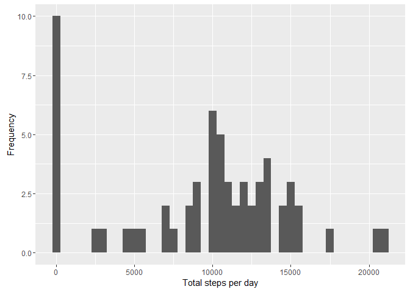
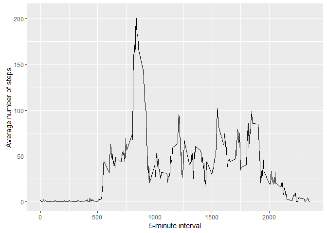
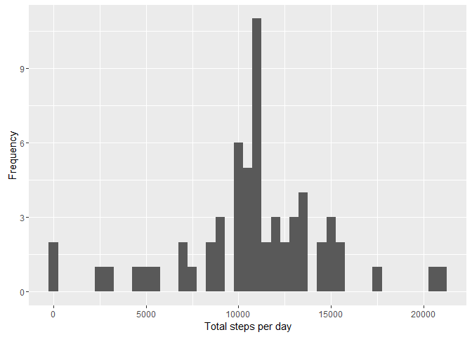

# Reproducible Research: Peer Assessment 1


## Loading and preprocessing the data
1. First we load libraries and clean all variables

```r
library(ggplot2)

rm(list = ls())
```
2. Now we load the data

```r
if(!file.exists('activity.csv')){
    unzip('activity.zip')
}
data <- read.csv('activity.csv')
```
2. Check some data details and structure

```r
names(data)
```

```
## [1] "steps"    "date"     "interval"
```

```r
str(data)
```

```
## 'data.frame':	17568 obs. of  3 variables:
##  $ steps   : int  NA NA NA NA NA NA NA NA NA NA ...
##  $ date    : Factor w/ 61 levels "2012-10-01","2012-10-02",..: 1 1 1 1 1 1 1 1 1 1 ...
##  $ interval: int  0 5 10 15 20 25 30 35 40 45 ...
```

```r
head(data)
```

```
##   steps       date interval
## 1    NA 2012-10-01        0
## 2    NA 2012-10-01        5
## 3    NA 2012-10-01       10
## 4    NA 2012-10-01       15
## 5    NA 2012-10-01       20
## 6    NA 2012-10-01       25
```

## What is mean total number of steps taken per day?
1. Make a histogram of the total number of steps taken each day

```r
sumSteps <- tapply(data$steps, data$date, sum, na.rm=TRUE)
qplot(sumSteps, xlab='Total steps per day', ylab='Frequency', binwidth=500)
```

<!-- -->

2. Calculate and report the mean and median total number of steps taken per day

Mean

```r
mean(sumSteps)
```

```
## [1] 9354.23
```

Median

```r
median(sumSteps)
```

```
## [1] 10395
```
## What is the average daily activity pattern?
1. Calculate the average of daily activity

```r
averages_daily <- aggregate(x=list(steps=data$steps), by=list(interval=data$interval),
                      FUN=mean, na.rm=TRUE)
```
1. Plot

```r
ggplot(data=averages_daily, aes(x=interval, y=steps)) +
    geom_line() +
    xlab("5-minute interval") +
    ylab("Average number of steps")
```

<!-- -->

2. Which 5-minute interval, on average across all the days in the dataset, contains the maximum number of steps?

```r
mostSteps <- which.max(averages_daily$steps)
averages_daily[mostSteps,]
```

```
##     interval    steps
## 104      835 206.1698
```
## Imputing missing values
1. check total number of missing values in the dataset

```r
missing <- is.na(data$steps)
table(missing)
```

```
## missing
## FALSE  TRUE 
## 15264  2304
```
1. Fill the missing values with the mean of all values

```r
activity_not_na <- data
# Replace each missing value with the mean value of its 5-minute interval
calculate_mean <- function(steps, interval) {
    filled <- NA
    if (!is.na(steps))
        filled <- c(steps)
    else
        filled <- (averages_daily[averages_daily$interval==interval, "steps"])
    return(filled)
}
activity_not_na <- data
activity_not_na$steps <- mapply(calculate_mean, activity_not_na$steps, activity_not_na$interval)
```
1. Plot histogram

```r
sumSteps <- tapply(activity_not_na$steps, activity_not_na$date, sum, na.rm=TRUE)
qplot(sumSteps, xlab='Total steps per day', ylab='Frequency', binwidth=500)
```

<!-- -->

2. Which 5-minute interval, on average across all the days in the dataset, contains the maximum number of steps?

Mean

```r
mean(sumSteps)
```

```
## [1] 10766.19
```

Median

```r
median(sumSteps)
```

```
## [1] 10766.19
```
## Are there differences in activity patterns between weekdays and weekends?
1. Create a new factor variable in the dataset with two levels - "weekday" and "weekend" indicating whether a given date is a weekday or weekend day.

```r
activity_not_na$dateType <-ifelse(as.POSIXlt(activity_not_na$date, format = "%Y-%m-%d")$wday %in% c(0,6), 'weekend', 'weekday')
```
2. Make a panel plot containing a time series plot

```r
averaged_activity_data<- aggregate(steps ~ interval + dateType, data=activity_not_na, mean)
ggplot(averaged_activity_data, aes(interval, steps)) + 
    geom_line() + 
    facet_grid(dateType ~ .) +
    xlab("5-minute interval") + 
    ylab("avarage number of steps")
```

<!-- -->
